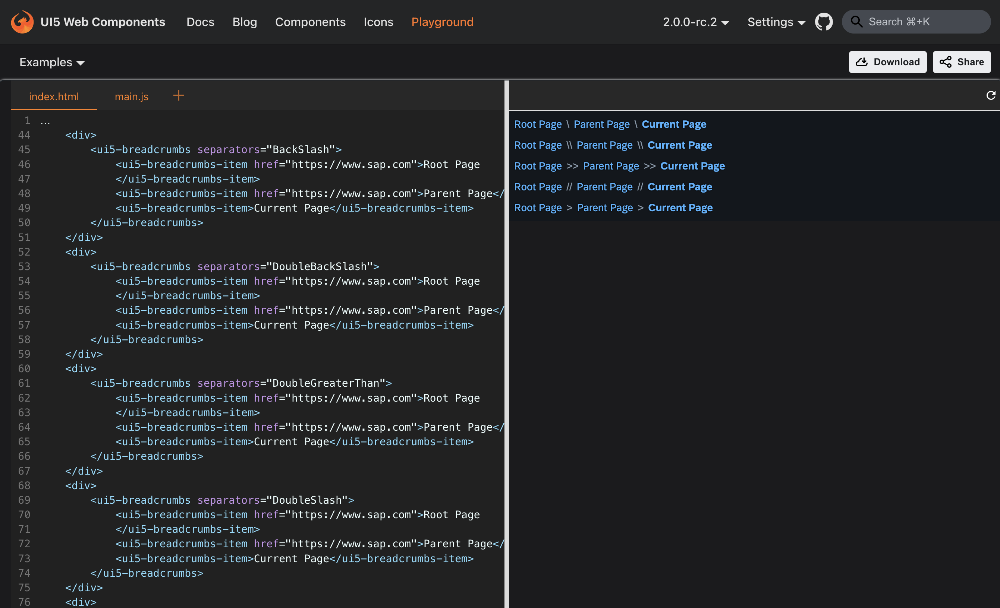

export const Highlight = ({children, color}) => (
  
    {children}
  
);

# UI5 Web Components 2.0 Release Candidate is out!

U5 Web Components project has reached a pivotal stage in its evolution, geared to embrace new standards, eliminate legacy code, and integrate consumer feedback to enhance our APIs, culminating in the highly anticipated major release, version 2.0. 

Today we are extremely happy to announce **UI5 Web Components 2.0 Release Candidate**! 🥳️
The following `2.0` RC versions have been released:
- [2.0.0-rc.0](https://github.com/UI5/webcomponents/releases/tag/v2.0.0-rc.0) (2024-04-09)
- [2.0.0-rc.1](https://github.com/UI5/webcomponents/releases/tag/v2.0.0-rc.1) (2024-04-11)
- [2.0.0-rc.2](https://github.com/UI5/webcomponents/releases/tag/v2.0.0-rc.2) (2024-04-18) 
- [2.0.0-rc.3](https://github.com/UI5/webcomponents/releases/tag/v2.0.0-rc.3) (2024-05-10)
- [2.0.0-rc.4 ](https://github.com/UI5/webcomponents/releases/tag/v2.0.0-rc.4) (2024-05-29)
- [2.0.0-rc.5](https://github.com/UI5/webcomponents/releases/tag/v2.0.0-rc.5) (2024-06-06) <Highlight color="#1877F2">latest</Highlight> 

## What's new

### New features

- **Integration of popover API**: Enjoy standard, consistent and flexible mechanism for displaying popover content on top of other page content with the integration of the [`popover API`](https://developer.mozilla.org/en-US/docs/Web/HTML/Global_attributes/popover) across all relevant components: [#8192](https://github.com/UI5/webcomponents/pull/8192)
  
- **Time zone Support**: Date and time components are enhanced to seamlessly adapt to different time zones, ensuring accurate presentation of dates across various regions. The time zone identifiers format aligns with the conventions used in the IANA time zone database. : [#8610](https://github.com/UI5/webcomponents/issues/8610)

- **New Components**: Explore new additions to the UI5 Web Components family, expanding your toolkit for building rich UIs:
    - Text: The ui5-text component displays text that can be used in any content area of an application. By default, the text will wrap when the space is not enough. In addition, the component supports truncation via the max-lines property, by defining the number of lines the text should wrap before start truncating. [#8299](https://github.com/UI5/webcomponents/pull/8299)

- **Components enhancements**: Benefit from enhancements to existing components such:
    - ui5-message-strip: introduce custom colors [#8757](https://github.com/UI5/webcomponents/pull/8757)
    - ui5-link: introduce `tooltip` property [#8670](https://github.com/UI5/webcomponents/pull/8670)
    - ui5-avatar-group: update focus handling [#8550](https://github.com/UI5/webcomponents/issues/8550) 
    - ui5-barcode-scanner-dialog: add support for `close` and `open` events [#8753](https://github.com/UI5/webcomponents/issues/8753)
    - ui5-li: add support for `F2` key [#8619](https://github.com/UI5/webcomponents/issues/8619)
    - ui5-button: provide focus support for mobile [#8414](https://github.com/UI5/webcomponents/issues/8414)
    - ui5-tree: enable drag and drop [#8477](https://github.com/UI5/webcomponents/issues/8477)
    - ui5-tabcontainer, ui5-list: add events for reordering items by mouse [#8265](https://github.com/UI5/webcomponents/pull/8265) [#8687](https://github.com/UI5/webcomponents/pull/8687) 
    - ui5-checkbox: update focus handling [#8553](https://github.com/UI5/webcomponents/issues/8553)
    - focus: new focus handling [#8590](https://github.com/UI5/webcomponents/issues/8590) 
    - add `shadowRootOptions` for `@customElement` decorator [#8703](https://github.com/UI5/webcomponents/issues/8703)

- **New Site for Documentation, Samples, and API Reference**: Discover a revamped documentation site with live editor, playground, dark mode, and an intuitive icons view. 

### Breaking changes
UI5 Web Components 2.0 is a new major version, including breaking changes requiring you to adjust your code accordingly. 

:::tip

This documentation will help you to migrate from UI5 Web Components v1.x to UI5 Web Components 2.0 with ease: [Migration guide 2.0](/docs/migration-guides/to-version-2/)

:::

Notable breaking changes include: 

- Discontinuing support for Internet Explorer: [#8494](https://github.com/UI5/webcomponents/pull/8494)
- CSP via [`adoptedStyleSheets`](https://developer.mozilla.org/en-US/docs/Web/API/Document/adoptedStyleSheets) only: [#8496](https://github.com/UI5/webcomponents/pull/8496)
- The JSDoc plugin has been removed, and the generation of api.json has stopped. If you previously relied on the `ui5-package/dist/api.json` file, you can now use `ui5-package/dist/custom-elements.json`: [#8518](https://github.com/UI5/webcomponents/pull/8518)
- Removed `UI5Element#render` method in favour of `UI5Element#renderer`: [#8501](https://github.com/UI5/webcomponents/pull/8501) 
- Removed all `Assets-static.js` modules in favour of their dynamic counterparts - the `Assets.js` modules: [#8526](https://github.com/UI5/webcomponents/pull/8526)

:::note

For the full list of changes, please refer to the release [change log](https://github.com/UI5/webcomponents/releases).

:::

## What's next
Anticipate the official 2.0 release between mid-June to mid-July, featuring: 🚀

### In-Progress Features

-   **Form Support with Form-Associated Custom Elements**: Streamline form handling with support for the Form-Associated Custom Elements standard.
-   **New Components**: Dynamic Page, Form, and Tokenizer
-   **Component Enhancements**: Revamped Notifications Experience
-   **Reusable component CSS styles** Allow creating patterns/layouts or other common styling

### In-Progress Breaking changes

-  **Theming**: Removal of Belize (recommendation: migrate to Horizon)
-  **Rename of properties, events and enumarion values**

-  **Several APIs will be replaced with more effective alternatives:**:

	-   Replace all public methods for opening popover, such as `openPicker`, `togglePicker` with `open` property to promote declarative APIs
	-   Grouping of Items: Instead of using `ui5-li-groupheader` as separator in a flat structure, the API will support true nesting of ListItems inside ListItemGroup, to easier bind hierarchical data model to the UI.
	-   Menu: property `starts-section` replaced by `ui5-menu-separator` component.
	-   List: property `imag`e, replaced by slot `image`.
	-   TabContainer: `show-overflow` property, replaced by slot `overflowButton`.
	-   IllustratedMessage: property `titleLevel`, replaced by slot `title` (that you can set the level on).

:::warning[**This properties will be removed without alternative**:]

-   Progress Indicator (ui5-progress-indicator): Remove `disabled` property 
-   Selects's Option (ui5-option): Remove `disabled` property - UX and ACC standards suggest to not include any disabled items in the dropdown
-   Token (ui5-token): Remove the `readonly` property 

:::

## Get help
Encountering issues? Don't hesitate to report them or seek assistance on our GitHub project: [Submit a bug or ask a question here](https://github.com/UI5/webcomponents/issues/new/choose).

## Maintenance of 1.x
While we're excited about the future with UI5 Web Components 2.0, we also understand the importance of continued support for existing users. Therefore, maintenance and support for version 1.x will continue until the end of the year, focusing solely on bug fixes.

## Conclusion
In conclusion, UI5 Web Components 2.0 represents a significant leap forward in our commitment to delivering cutting-edge web development tools. We're excited to embark on this journey with you and look forward to seeing the amazing experiences you'll create with UI5 Web Components 2.0!

Stay tuned for more updates and announcements as we approach the official release date. Thank you for being part of the UI5 Web Components community! 🙌
