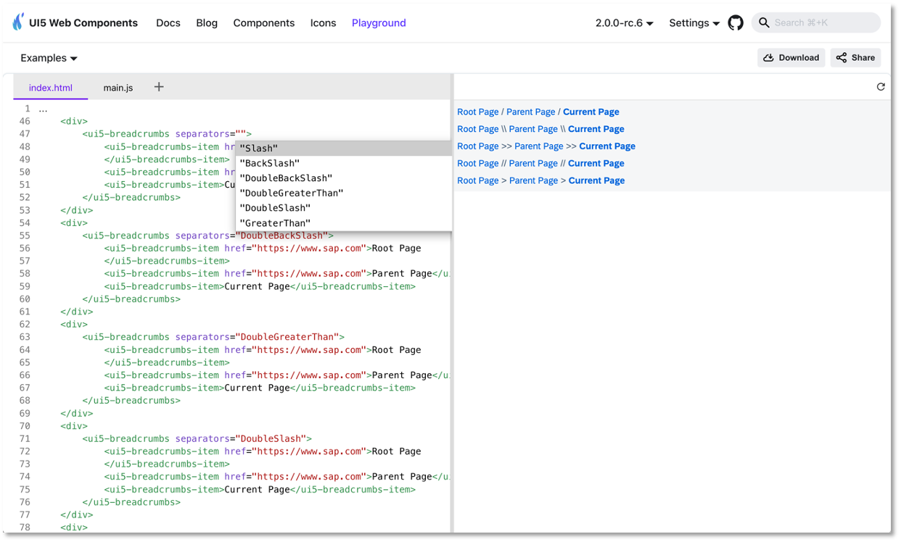

# Announcing UI5 Web Components 2.0: A New Era Begins! 

## A Journey of Innovation and Growth 

Since the release of UI5 Web Components 1.0 in 2021, our journey has been marked by unwavering innovation and a commitment to excellence. Over the past three years, we have listened to our community, refined our technologies, and expanded our capabilities. 

Our project has continuously evolved, embracing new web standards, eliminating legacy code, and integrating invaluable user feedback from our community to enhance our APIs. This journey culminated in April with the unveiling of the first Release Candidate for UI5 Web Components 2.0.

## Announcing UI5 Web Components 2.0! 🎉 

Today, we stand at a pivotal moment in our evolution with the official launch of UI5 Web Components 2.0. This major release marks a new era, enhancing performance and reliability while setting the stage for future innovations. Our commitment to growth and providing cutting-edge tools for web development ensures we continue to meet the evolving needs of our community.

**Key Benefits of UI5 Web Components 2.0**

UI5 Web Components 2.0 introduces several substantial improvements: 

- Embracing New Standards: Future-proofing UI5 Web Components. 

- Consistent APIs: Streamlined and more intuitive, albeit with some breaking changes. 

- Elimination of Legacy Code: Reducing footprint and enhancing quality by minimizing bugs.  

Looking ahead, we will adhere to Semantic Versioning and release major updates more frequently to keep pace with technological advancements. 

## What's New in UI5 Web Components 2.0? 

### **Revolutionary Popover API**

Experience a standardized, consistent, and flexible mechanism for displaying popover content across all relevant components.  
This API allows popups to display correctly above all other content, eliminating the need for the "static area" used in version 1.x. Previously, popups were placed in a static area within the body to ensure correct positioning despite various CSS rules. In version 2.x, the [popover API](https://developer.mozilla.org/en-US/docs/Web/HTML/Global_attributes/popover) simplifies the DOM structure by incorporating the popover directly within the component. This results in easier development, maintenance, and enhanced styling capabilities. It also allows components with popups to have physical children, supporting custom content and simplifying testing. The popover API is fully supported by all major browsers. Discover all the practical benefits in our [blog post](https://ui5.github.io/webcomponents/nightly/blog/releases/popover-api-in-v2/).

### **Form-Associated Custom Elements**

Harness the power of native input behavior within HTML forms. This enhancement makes the features/InputElementsFormSupport.js feature redundant, simplifying form handling and enhancing the developer experience. Refer to the [ElementInternals API documentation](https://developer.mozilla.org/en-US/docs/Web/API/ElementInternals) for more details. 

### **Seamless Time Zone Support**

Seamlessly manage time zones within your applications for a more personalized user experience. The date and time components are adapted to the time zone feature, allowing the components to present dates in different time zones. The time zone identifiers format is the one used in the IANA time zone database. See a [sample](https://ui5.github.io/webcomponents/nightly/components/DateTimePicker/#timezones) on our website.

### **New Components**

Expand your UI toolkit with new components such as Dynamic Page, Form, Table, Text, Tokenizer, AI Button, and AI Prompt Input. 

- [Dynamic Page](https://ui5.github.io/webcomponents/nightly/components/fiori/DynamicPage/): A layout component, representing a web page, consisting of a title, a header with dynamic behavior, a content area, and an optional floating footer. Use the Dynamic Page if you need to have a title, that is always visible and a header, that has configurable Expanding/Snapping functionality. 
- [Form](https://ui5.github.io/webcomponents/nightly/components/Form/): The `ui5-form` is a layout component that arranges labels and form fields (like input fields) pairs into a specific number of columns. And, there is also "grouping" available to assist the implementation of richer UIs. The Form component reacts and changes its layout on predefined breakpoints.
- [Table](https://ui5.github.io/webcomponents/nightly/components/Table/): The `ui5-table` component provides a set of sophisticated features for displaying and dealing with vast amounts of data in a responsive manner. This Table replaces the previous Table web component, that has been part of @ui5/webcomponents version 1.x. For compatibility reasons, we moved the previous Table implementation to the `@ui5/webcomponents-compat` package and will be maintained until the new Table is experimental.
- [Text](https://ui5.github.io/webcomponents/nightly/components/Text/): The `ui5-text` component displays text that can be used in any content area of an application. By default, the text will wrap when the space is not enough. In addition, the component supports truncation via the max-lines property, which defines the number of lines the text should wrap before it starts truncating.
- [Tokenizer](https://ui5.github.io/webcomponents/nightly/components/Tokenizer/): A `ui5-tokenizer` is an invisible container for `ui5-tokens` that supports keyboard navigation and token selection.
- [AI Button](https://ui5.github.io/webcomponents/nightly/components/ai/Button/): The `ui5-ai-button` component represents a button used in AI-related scenarios. It enables users to trigger actions by clicking or tapping the ui5-ai-button, or by pressing certain keyboard keys, such as Enter.
- [AI Prompt Input](https://ui5.github.io/webcomponents/nightly/components/ai/PromptInput/): The `ui5-ai-prompt-input` component allows the user to write custom instructions in natural language so that AI is guided to generate content tailored to user needs.
- [Custom Option](https://ui5.github.io/webcomponents/nightly/components/OptionCustom/): The `ui5-option-custom` component defines a custom content of an option in the `ui5-select`. The component accepts arbitrary HTML content to allow full customization.
- [Custom Suggestion Item](https://ui5.github.io/webcomponents/nightly/components/SuggestionItemCustom/): The `ui5-suggestion-item-custom` is a type of suggestion item, that can be used to place suggestion items with custom content in the input. 
- [Notification List](https://ui5.github.io/webcomponents/nightly/components/fiori/NotificationList/): The `ui5-notification-list` web component acts as a container for `ui5-li-notification-group` and `ui5-li-notification`, delivering the new SAP Design Notification experience.
- [List Group](https://ui5.github.io/webcomponents/nightly/components/ListItemGroup/): The `ui5-li-group` is a special list item used exclusively for creating groups of list items within a `ui5-list`.

### **Enhanced Existing Components** 

Benefit from improvements in List Drag and Drop, Tree Drag and Drop, Tab Container Drag and Drop, and a revamped Notifications Experience. 

:::note

For the full list of changes, please refer to the release [change log](https://github.com/UI5/webcomponents/releases).

:::

### **Revamped Documentation Site**

Explore our new documentation site featuring a live editor, playground, dark mode, and an intuitive icons view. 

**New logo**: We are excited to introduce our new symbol and branding, reflecting the modern and dynamic nature of our project. Our new design incorporates defining elements of the feather and the flame. The feather symbolizes being lightweight, while the flame forms a connection to the phoenix, embodying the spirit of rebirth and continuous improvement. 

**Explore the Full-Screen Playground** 

Our new [full-screen playground](https://ui5.github.io/webcomponents/nightly/play/) offers a range of features designed to enhance your development experience: 

- Live code editing 

- TypeScript support 

- Code completion for components in HTML 

- Sample download 

- Easy sharing 

- Theming options 

- Predefined examples

## Adoption and Breaking Changes 

UI5 Web Components 2.0 is a major version and introduces breaking changes that may require updates to your code. Note: The majority of the breaking changes can be achieved with find and replace. 

:::tip

Our comprehensive [Migration Guide](https://ui5.github.io/webcomponents/nightly/docs/migration-guides/to-version-2/) will assist you in making a smooth transition from UI5 Web Components v1.x to v2.0. 

:::

 **Notable Breaking Changes**: 

- The Belize theme has been removed and is no longer available.

- CSP (Content Security Policy) will be ensured via the [`adoptedStyleSheets`](https://developer.mozilla.org/en-US/docs/Web/API/Document/adoptedStyleSheets) only, which are CSP-compliant by design. 

- The static area has been removed since the browser now ensures the correct positioning of popups thanks to the popover API that is fully adopted by the UI5 Web Components.

- The Badge component (`ui5-badge`) has been renamed to Tag (`ui5-tag`).

- The old Table (`ui5-table`) has been moved to `@ui5/webcomponents-compat`; new Table is available with better API and accessibility.

- Public methods for opening popovers are replaced with the `open` property for declarative APIs. 

- Components like Label, Text, Link, and Title now wrap by default (`wrappingType="Normal"` by default, `wrappingType="None"` optionally). 

- SelectMenu and SelectMenuOption components have been removed; standard options with the popover API make them obsolete. 

- Renaming of properties, events, and enumeration values.

- Removed APIs without alternatives: 

  - Progress Indicator (`ui5-progress-indicator`): `Disabled` property removed. 

  - Select Option (`ui5-option`): `Disabled` property removed for UX and accessibility alignment. 

  - Token (`ui5-token`): `Readonly` property removed; logic now within the Tokenizer. 

  - The `Device#isIE` method has been removed and is no longer available - the IE browser is not supported anymore.

  - Notification List Group (`ui5-li-notification-group`): The properties `showClose`, `showCounter`, `priority`, the event `close` and the slot `actions` are removed due to the new better notification list design concept.
 
## Ongoing Support for Version 1.x 

 We will continue to support version 1.x until the **end of June 2025**, focusing on bug fixes to ensure continuity for our existing users. 

 
## Get Help and Engage with the Community 

 Encountering issues? Reach out for support or report bugs on our GitHub project: [Submit a bug or ask a question here](https://github.com/UI5/webcomponents/issues/new/choose). 

## Call to Action 

UI5 Web Components 2.0 is a testament to our dedication to innovation, quality, and community engagement. We are particularly excited about the groundbreaking features such as the Popover API, Form-Associated Custom Elements, and seamless time zone support. 

We invite you to preview the new version and migrate to UI5 Web Components 2.0 to fully leverage these advancements. Together, we are entering a new era of web development, and the possibilities are endless. Thank you for being part of this exciting journey with us! 🙌 

   

 

