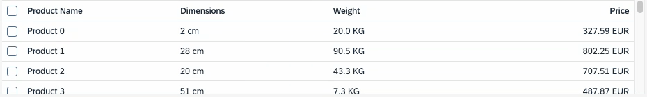
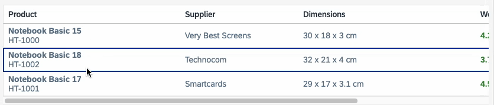

# The Table Web Component is Now Productive - Here's What's New

After its half-year tenure as an experimental component since the release of UI5 Web Components 2.0, allowing us to gather feedback
and improve the API, the Table component will finally leave its experimental state!

This blog will update you on why we've decided to take this path, the improvements and new features of the `ui5-table`.

## Going from Old to New

Back in UI5 Web Components 1.x, the library already offered a Table component, which provided developers with capabilities to display
data in a tabular structure.

Upgrading to a new version gave us the chance to reassess and reimagine the Table component, allowing us to focus on three core points:
* Improved accessibility
* Harmonization between the Web Component Table and UI5 Tables
* Enhancements to existing APIs and incorporation of new ideas

As providing a completely new component with a fresh and new API might lead to issues, we've decided to publish the Table in an experimental state.
This has given us the time to manifest the final API, but most importantly the chance to listen to your feedback and improve our API based on it.

Finally, thanks to your feedback, we removed the experimental state of the `ui5-table`.

## What's New?

### Table and ARIA Structure

We've revamped the structure of the `ui5-table` component. The new structure is heavily inspired by the HTML table, instead of having a dedicated `<ui5-column>`, you'll
define a `<ui5-table-header-row>`, which contains a `<ui5-table-header-cell>`:

<table>
	<tr>
		<th>HTML Table</th>
		<th>Web Component Table</th>
	</tr>
	<tr>
		<td>
```html
<table>
  <tr>
    <th>Column A</th>
    <th>Column B</th>
  </tr>
  <tr>
    <td>Cell 1</td>
    <td>Cell 2</td>
  </tr>
</table>
```
		</td>
		<td>
```html
<ui5-table>
  <ui5-table-header-row slot="headerRow">
    <ui5-table-header-cell>Column A</ui5-table-header-cell>
    <ui5-table-header-cell>Column B</ui5-table-header-cell>
  </ui5-table-header-row>
  <ui5-table-row>
    <ui5-table-cell>Cell 1</ui5-table-cell>
    <ui5-table-cell>Cell 2</ui5-table-cell>
  </ui5-table-row>
</ui5-table>
```
		</td>
	</tr>
</table>

We've also decided to apply ARIA roles, such as "row" or "gridcell", directly to the Web Components instead of hiding them in the Shadow DOM, applying
the semantics directly to the component. 
This change in combination with the new structure enables a better accessibility and screen reader support, as the new Table component now structurally
and semantically resembles the HTML table, ensuring an easier processing for assistive  technologies.

### Keyboard Handling

Apart from moving the ARIA roles from the Shadow DOM to the "light" DOM, allowing you to directly reference other components (except for the table root) via `aria-labelledby`, accessibility
has been greatly improved in other areas as well.

One major change you might notice is the updated keyboard handling for the table. While previously you were only able to navigate through the table row by row, the
newly implemented keyboard specification allows you to navigate row by row **and** from cell to cell. This update aligns the Table component with its counterparts
in UI5 in terms of keyboard handling.


Check the [SAPUI5 Accessibility for End Users](https://help.sap.com/docs/SAPUI5/bc5a64aac808463baa95b4230f221716/10c137d404874350b886cc988aa63c1c.html?locale=en-US) for more information
about the handling.

### Feature Concept

If you use the new `ui5-table` for the first time, you might notice that "core features" of the former Table implementation might be missing, such as growing capabilities or
selection functionality.

This discrepancy is intended as we wanted to provide a lightweight component for users that might not need such features.

If you require selection or growing capabilities, you can extend your Table component by assigning *Features* to it. The core idea of a *Feature* is to provide a
plug-and-play option for more complex features of the Table. This allows you to keep the Table as lightweight as possible ensuring only necessary
code/functionality is being used.

The `ui5-table` has a dedicated `features` slot to enable certain features, which are dedicated components. We are currently offering the following features:
[TableSelectionSingle](https://ui5.github.io/webcomponents/components/TableSelectionSingle/), [TableSelectionMulti](https://ui5.github.io/webcomponents/components/TableSelectionMulti/),
 [TableGrowing](https://ui5.github.io/webcomponents/components/TableGrowing/), and [TableVirtualizer](https://ui5.github.io/webcomponents/components/TableVirtualizer/).

```html
<ui5-table>
  ...
  <ui5-table-selection-single slot="features" />
  <ui5-table-growing slot="features" />
  <ui5-table-virtualizer slot="features" />
</ui5-table>
```

#### Selection Feature

As you may have noticed, there are now **two** selection features: `TableSelectionSingle` and `TableSelectionMulti`. Instead of a single, unified selection feature, we chose to separate
them to keep the API lean, clean, and better suited to their respective use cases. This approach also helps manage complexity as each selection mode has distinct API requirements
and behaviors.

Additionally, selection is no longer handled at the row level. Previously, `ui5-table-row` had a `selected` property, but this has been removed. Instead, selection is now decoupled from
the table, and the selection feature itself maintains a `selected` property containing the keys of selected rows. To enable this, you need to provide a `row-key` for your rows to uniquely
identify them.

For an example implementation, see [here](https://ui5.github.io/webcomponents/components/TableSelectionMulti/#basic-sample).

#### Growing Feature

In addtion to revamping the selection behavior, we've decided to improve and adapt the growing behavior as well. `TableGrowing` enables growing capabilities and provides two different
growing modes:
- `Button`: Renders a button to load more data
- `Scroll`: Scrolls to the bottom of the table to load more data

We have slightly improved the `Scroll` behavior: If the table is not scrollable yet, the growing button will be rendered until the table is scrollable. This will always ensure
that the table offers its growing capabilities when using `TableGrowing`.

You can check these samples to see implementations of both growing modes:
- [Growing with a Button](https://ui5.github.io/webcomponents/nightly/components/TableGrowing/#growing-with-a-button)
- [Growing with Scrolling](https://ui5.github.io/webcomponents/nightly/components/TableGrowing/#growing-with-scrolling)

#### Virtualization

`TableVirtualizer` is a new feature that is currently still experimental. Its main purpose is to virtualize table rows, allowing you to display huge amounts of data without rendering
everything straight to the browser compromising performance.

This feature ensures that only the rows visible in the current viewport are rendered and updated during scrolling. To achieve this, the `TableVirtualizer` offers a
`range-change` event allowing you to exchange or update the row contexts and contents accordingly.

A sample implementation can be found [here](https://ui5.github.io/webcomponents/components/TableVirtualizer/#basic-sample).



### New Functionalities

#### Overflow Mode

The old Table component used the popin mode by default, a responsive display option optimal for small screen sizes. Defining a `minWidth` for the column, a minimum table width,
allows the column to move into the popin area  if the table is smaller than the specified `minWidth`.

This overall behavior has changed now with the new `ui5-table`.

First of all, the Table component introduces the `overflowMode`. This property allows you to switch between popin mode and horizontal scrolling, giving you flexibility
with the overflow behavior of your table.

Furthermore, the "popin configuration" has changed. Instead of defining a `minWidth` representing the "minimum table width", you can define `width` or `minWidth` for the
column itself. If the table overflows, the columns that overflow, for example,  if they don't fit into the table anymore, will be moved into the "popin area". This is a more natural
overflow behavior allowing you to just define the widths of your columns without worrying about the general table width.

See [here](https://ui5.github.io/webcomponents/components/Table/#overflow-mode) for a sample.

#### Row Actions

The `ui5-table` introduces row actions. The `ui5-table-row` has a dedicated `actions` slot, which allows you to add custom row actions to your rows.

There are two row action options:
* Use [`TableRowActionNavigation`](https://ui5.github.io/webcomponents/components/TableRowActionNavigation/) to define a navigation action.
* Use [`TableRowAction`](https://ui5.github.io/webcomponents/components/TableRowAction/) to define a custom navigation. Provide a text and icon for your custom action.

```html
<ui5-table-row row-key="2">
  <ui5-table-cell><ui5-label><b>Astro Laptop 216</b><br><a href="#">HT-1251</a></ui5-label></ui5-table-cell>
  <ui5-table-row-action slot="actions" icon="delete" text="Delete" handler="onDelete"></ui5-table-row-action>
  <ui5-table-row-action-navigation slot="actions" handler="onNavigate" interactive></ui5-table-row-action-navigation>
</ui5-table-row>
```


#### Drag And Drop

The Table component is now drag-and-drop-enabled! By utilizing the Table's `move-over` and `move` event, you can now move around table rows.

This allows you to implement features such as row reordering, exchanging data between tables, and many more.



## Summary

The `ui5-table` and its related components (except for `TableVirtualizer`) are finally "graduating" from their experimental state and will move into a stable state.
The new table offers new and improved features, accessibility and user experience.

For compatibility reasons, the old table is still available in the `compat` package, but please migrate to the new table implementation to leverage the newest
features and functionalities.

If you are interested in learning more about the `ui5-table`, check out the [documentation](https://ui5.github.io/webcomponents/components/Table/), or join
us at [UI5con](https://openui5.org/ui5con/)!
